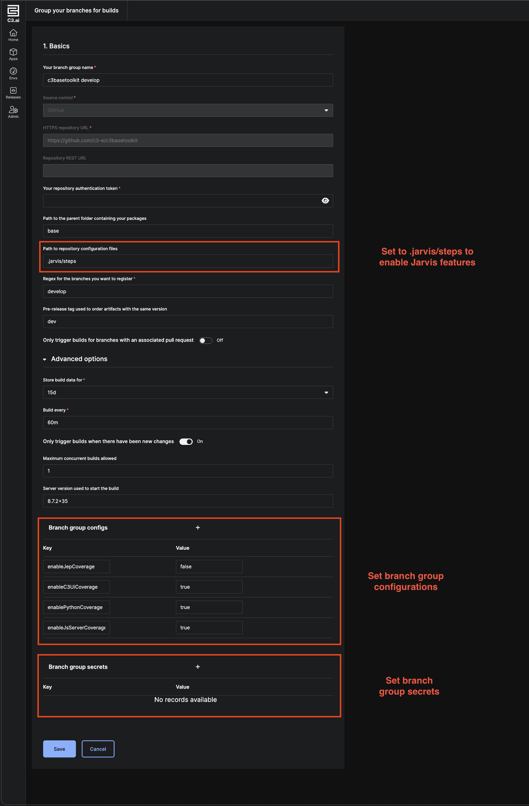

# c3standards custom Jarvis steps

The c3standards repository distributes custom Jarvis steps for the following features:

- Test avoidance
- Multi-repository builds
- C3 AI Code Analyzer
- Documentation Artifact Generation

This document describes the setup and usage instructions for these features.

## Table of contents

- [Table of contents](#table-of-contents)
- [Setup](#setup)
- [Test avoidance](#test-avoidance)
  - [Base branch resolution](#base-branch-resolution)
  - [Configuring default base branch](#configuring-default-base-branch)
- [Multi-repository builds](#multi-repository-builds)
  - [Configuring multi-repository builds](#configuring-multi-repository-builds)
- [C3 AI Code Analyzer](#c3-ai-code-analyzer)
  - [Setting up C3 AI Code Analyzer](#setting-up-c3-ai-code-analyzer)
  - [Customizing the C3 AI Code Analyzer](#customizing-the-c3-ai-code-analyzer)
    - [Backup token](#backup-tokens)
    - [Maximum inline comments](#maximum-inline-comments)
    - [Reporting results to `c3codeanalytics`](#reporting-results-to-c3codeanalytics)
- [Documentation Artifact Generation](#documentation-artifact-generation)
  - [Configuring automatic documentation generation](#configuring-automatic-documentation-generation)
  - [Downloading documentation artifacts](#downloading-documentation-artifacts)
    - [Steps to download documentation artifacts](#steps-to-download-documentation-artifacts)

## Setup

To benefit from the C3 AI Release Management (Jarvis) features distributed through c3standards, set the
"Path to repository configuration files" on your registered branch groups to `.jarvis/steps`.

<!-- vale Vale.Terms = NO -->



<!-- vale Vale.Terms = YES -->

## Test avoidance

By default, Jarvis generates artifacts, bundles UI, and runs tests for _all_ packages in the repository. During
development, it might be sufficient for these steps to be run for only the modified packages and their downstream
dependencies.

### Configuring regular expression for test avoidance branches

By default, test avoidance is enabled for all branches that start with a `feature/` or `task/` token. To configure which
branches should have test avoidance enabled, update configure the `testAvoidanceBranchRegex` regular expression in the
[config/config.js](steps/config/config.js) file.

> [!NOTE]
>
> The validity of the regular expression can be checked by running the following command in the static console
>
> ```javascript
> var testAvoidanceBranchRegex = '<your_regex>'; // Example: '(^feature/.*)|(^task/.*)';
> var branch = '<your_branch_name>'; // Example: 'feature/engx/ENGR-123';
> branch.match(testAvoidanceBranchRegex);
> ```
>
> If you expect the branch name to be matched by the regex, your should see a non-empty list of matched patterns.

### Base branch resolution

The test avoidance feature determines which packages are affected by a change by comparing the file changes made between
the commit on which the build is running and a "base branch" to which the changes are intended to be merged.

The resolution for the base branch is done as follows:

- If the commit has an associated PR, compare against the base branch of the PR.
- If the commit has no associated PR, use the configured default base branch for the `Jarvis.BranchGroup` that triggered
  the build. See _Configuring default base branch_ below.
- If the commit has no associated PR and no configured default base branch on Jarvis, use the default branch configured
  on the repository.

### Configuring default base branch

Development teams might sometimes use long-standing epic/feature branches during feature development, say
`epic/engx/new-feature`. Since these branches might not have an associated PR until the branch is ready to be merged to
a mainline, the c3standards repository provides a mechanism to configure test avoidance to use `epic/engx/new-feature`
as the default base branch for test avoidance.

The default base branch for these branch groups can be configured by setting the `defaultTestAvoidanceBranch`
configuration.

## Multi-repository builds

The c3standards repository distributes infrastructure to configure Jarvis to pick up changes across multiple
repositories during builds. This feature is intended for development teams to test the impact of their changes on a
shared package in an upstream repository on downstream repositories.

Consider the following dependency chain of repositories:

- **Repository A** holds shared packages used by multiple teams.
- Packages in **Repository B** owned by **Team B** depend on packages in **Repository A**
- Packages in **Repository C** owned by **Team C** depend on packages in **Repository A**

Since changes made to **Repository A** by **Team B** could affect **Repository C**, **Team B** can take precaution by
running builds for **Repository A**, **Repository B** and **Repository C** when committing changes to **Repository A**.

> [!TIP]
>
> Test avoidance is enabled even for multi-repository builds, i.e, only packages in **Repository B** and **Repository
> C** that depend on the modified packages in **Repository A** will be part of the build.

### Configuring multi-repository builds

1. Configure your `Jarvis.BranchGroup` to use `stashMultiRepo` as the first step.

   ```javascript
   var branchGroupId = `<branch_group_id>`;
   var triggerOptions = JarvisService.BranchGroup.make(branchGroupId).get().triggerOptions;
   var updatedTriggerOptions =
     Jarvis.BranchGroup.TriggerOptions.make(triggerOptions).withFirstStepName('stashMultiRepo');

   // Update `JarvisService.BranchGroup`.
   JarvisService.BranchGroup.make(branchGroupId).withTriggerOptions(updatedTriggerOptions).merge();
   ```

2. Configure the list of downstream dependencies

   ```javascript
   Jarvis.setBranchGroupConfigValue(
     `<branch_group_id>`,
     'downstreamRepositories',
     JSON.stringify({ '<repo>': '<branch>' })
   );
   ```

   For example,

   ```javascript
   Jarvis.setBranchGroupConfigValue(
     `<branch_group_id>`,
     'downstreamRepositories',
     JSON.stringify({ 'Repository B': 'develop' })
   );
   ```

> [!TIP]
>
> **Concurrent builds across repositories**
>
> The multi-repository build feature allows developers to run a build on a concurrent change made across two
> repositories for the same feature.
>
> For instance, say completing ticket ENGR-123 requires changes to both **Repository A** and **Repository B**. If the
> name of the branch in **Repository A** is `feature/engx/ENGR-123`, developers can use the same name for the branch
> making the concurrent changes to **Repository B** to signal to the multi-repository step that changes from
> `feature/engx/ENGR-123` in **Repository B** must be picked when building branch `feature/engx/ENGR-123` in
> **Repository A**.

## C3 AI Code Analyzer

The c3standards repository distributes the infrastructure to support the C3 AI Code Analyzer, an automatic code review
bot that performs static code analysis and customization analysis performed on your repository.

### Setting up C3 AI Code Analyzer

To setup C3 AI Code Analyzer in your repository,

- Integrate the custom Jarvis steps distributed through c3standards
- Configure your registered branch groups to use the Jarvis steps (see the [Setup](#setup) section)
- Add `baseToolkit` as an implicit/explicit dependency into all of the packages in your repository

### Customizing the C3 AI Code Analyzer

The behavior of the C3 AI Code Analyzer can be customized by configuring the [config/config.js](steps/config/config.js)
file.

#### Presets

Code analysis should behave slightly differently depending on whether the repository belongs to a base application or
a customer application. This configuration should be set to the following:

- `base-app` for base applications (default)
- `customer` for customer applications

#### Backup tokens

By default, the code analyzer uses the token of the user who created the Jarvis branch configuration in Studio. An
increased usage of this token could trigger secondary rate limits and it's suggested that at least one backup token be
provided to allow the C3 AI Code Analyzer to perform automated reviews without interruptions.

Backup tokens must be set on a registered branch group which could require elevated permissions. Please ask a user
with `C3.JarvisAdmin.Role` or above to perform this operation. See the
[Update the Configurations on a Registered Branch Group in C3 AI Release Management guide](https://developer.c3.ai/docs/8.7/guide/guide-studio-rm/rm-update-register-branches) guide for more information on how to update this configuration through the Studio UI.

#### Maximum inline comments

By default, the code analyzer posts a maximum of 10 inline comments on a pull request. The maximum comment count can be
configured to be any number greater than 0 by setting the `maxCodeAnalyzerCommentCount` build configuration.

#### Reporting results to `c3codeanalytics`

The [c3-e/c3codeanalytics](https://github.com/c3-e/c3codeanalytics/tree/results?search=1) repository is a centralized
repository to store and monitor all code quality and customization analysis metrics collected by the C3 AI Code
Analyzer.

By default, the code analyzer doesn't push the results of the code analysis to a centralized repository for code
analytics. Setting `reportResultsToCodeAnalytics` to true pushes the changes to `c3codeanalytics` for observability.

The specific branches to monitor can be configured by the setting the `storeResultBranches` configuration. By default,
the three mainline branches `develop`, `release` and `master` are monitored.

> [!CAUTION]
>
> The `topLevelCustomerPackage` and `customerPackages` configurations **must** be set if reporting is enabled for
> customer repositories. This information critical to ensure the code analyzer doesn't capture any customer IP.

If this configuration is turned on for customer repositories, the `topLevelCustomerPackage` and the `customerPackages`
configurations HAVE to be provided. The `topLevelCustomerPackage` must be set to point to the name of the top-level
package in the customer repository that's eventually deployed to prod. `customerPackages` must list _**all**_ the
packages created in the customer repository.

## Documentation Artifact Generation

> [!IMPORTANT]
>
> Enabling this feature is **mandatory** for C3 AI product teams.

The Types, topics, guides and tutorial notebooks in Applications / products made generally available are shown to
customers through the [C3 AI Developer Portal](https://developer.c3.ai/). These artifacts are also uploaded to the C3
Generative AI bot on the [Community developer forum](https://community.c3.ai/).

c3standards provides the infrastructure to automatically generate documentation artifacts. Each product team is
responsible for delivering these artifacts to Release Management.

### Configuring automatic documentation generation

The following configurations in the `config/config.js` file must be set:

- `generateDocumentationArtifacts` must be set to `true`
- Configure `documentationArtifactGenerationBranches` to additional branches, if necessary.
- Set the `documentationApplicationIdentifiers` configuration. See documentation in
  [config/config.js](./steps/config/config.js) for more information.

### Downloading documentation artifacts

Documentation artifacts are generated and stored automatically for the configured packages in
`documentationApplicationIdentifiers` on builds run on `documentationArtifactGenerationBranches`.

These artifacts can be found on the `artifacthubservice` of the Studio on which builds are run.

#### Steps to download documentation artifacts

##### Step 1: Identify artifact

Identify the documentation artifact in `artifacthubservice` by running the following command where:

- `<package>` corresponds to the name of the package configured in `documentationApplicationIdentifiers`
- `<semanticVersion>` is the semantic version of the artifacts generated in that build

```javascript
artifactId = ArtifactHubService.Artifact.fetch(
  Filter.eq('kind', 'DOCUMENTATION')
    .and()
    .eq('name', '<package>')
    .and()
    .contains('semanticVersion', '<semanticVersion>')
).first().id;
```

##### Step 2: Download artifact

Download the artifact by running:

```javascript
Js.exec(
  `(artifactId) => {
  artifact = ArtifactHubService.Artifact.make(artifactId).get('content')
  return TmpFileSystem.createTmpFile({ ttl: 60 * 60 }).writeStream(artifact.content.get().stream()).apiEndpoint("GET", true);
}`,
  [artifactId]
);
```
