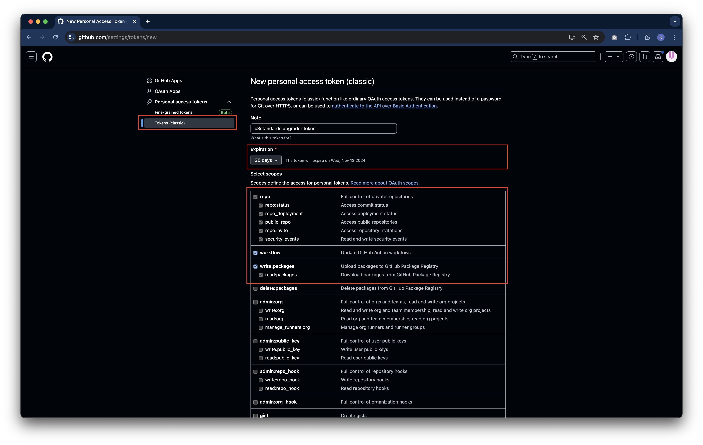
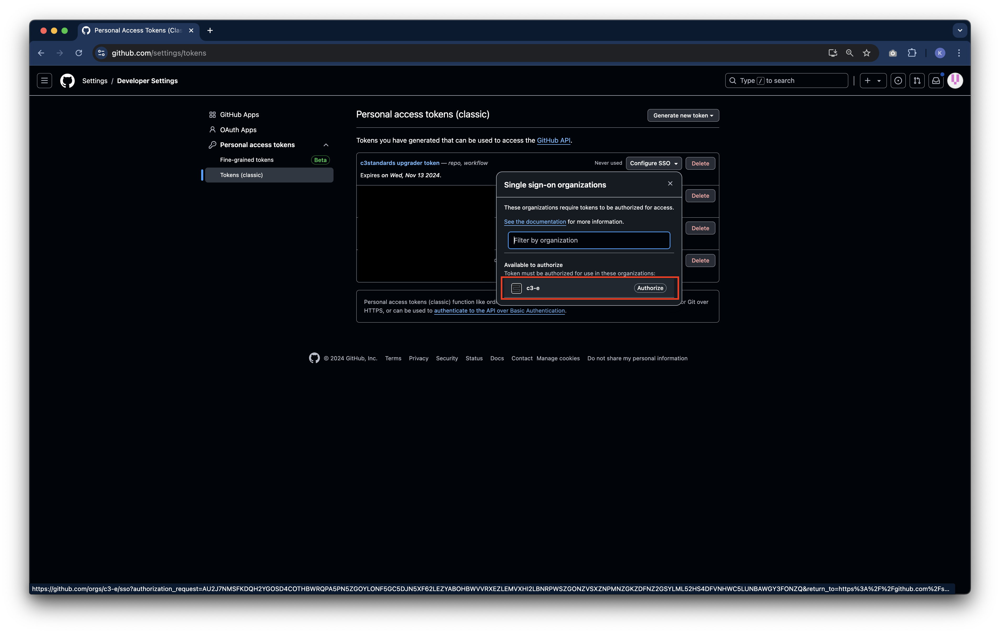
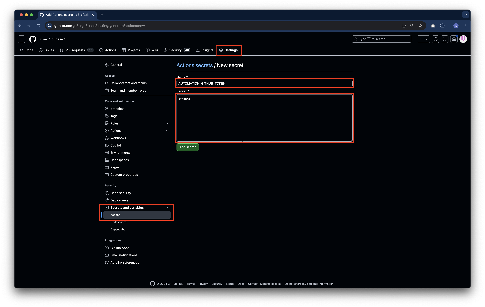
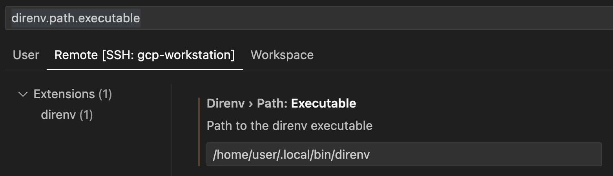

# C3 Standards

> [!IMPORTANT]
>
> `c3-e/c3standards` is a template repository that must integrate into your team's repository (example `c3base`). Please
> ensure you run all scripts here in your Git repository and not in `c3standards`.

The `c3standards` repository serves as a centralized hub to distribute setup scripts, linting configurations, auto
formatters, pre-commit hooks, and custom Jarvis steps to enforce coding standards across all c3 repositories.

The linting rules follow the coding standards set in the
[c3guidelines](https://github.com/c3-e/c3guidelines/blob/master/README.md) repository.

The custom Jarvis steps are in covered in more detail in the [`.jarvis/steps` README](.jarvis/README.md).

See the [Integrating c3standards into your repository](#integrating-c3standards-into-your-repository) section for more
info on how to integrate and stay in-sync with the `c3standards` repository.

> [!TIP]
>
> TL;Dr: To update your current tools if [local setup](#installing-code-standards-tools-for-local-development) has
> already been done, run the following commands:
>
> Google Cloud Platform (GCP) Workstation / Linux / Mac:
>
> ```shell
> cd setup
> make install
> ```
>
> Windows:
>
> ```shell
> npm install
> ```

## Table of contents

- [Integrating c3standards into your repository](#integrating-c3standards-into-your-repository)
- [Repository best practices](#repository-best-practices)
- [Installing code standards tools for local development](#installing-code-standards-tools-for-local-development)
- [Auto fixing linting issues](#auto-fixing-linting-issues)
- [Linting](#linting)
  - [ECMAScript linting](#ecmascript-linting)
  - [Python linting](#python-linting)
  - [Prose linting](#prose-linting)

## Integrating c3standards into your repository

Each repository administrator is responsible for integrating and keeping up-to-date with the `c3standards` repository.

### Who should follow this section?

- Repository administrators responsible for the integration and maintenance of c3standards.

### When to follow this section?

- When setting up a new repository.
- When an existing repository must implement c3standards.
- When there are updates to c3standards.

### Pre-integration steps

Before integrating `c3standards`, please save your existing linting customizations and remove all linting and pre-commit
hooks from your repository. This process involves removing the following files and directories:

- `.eslintrc`
- `.pylintrc`
- `linting/`
- `node_modules/`
- `package.json`
- `package-lock.json`
- `pre-commit-config.yaml`
- `scripts/`

You can reintroduce any custom rules on top of those provided by `c3standards` after the integration is complete into
your repository.

### Integration process

To integrate `c3standards` into your repository or to update your repository with latest tooling updates, follow these
steps:

1. **Add `c3standards` as a remote repository:**

   ```shell
   git remote add c3standards git@github.com:c3-e/c3standards.git
   git fetch --all
   ```

2. **Identify the correct c3standards support branch for your repository:**

   `c3standards` supports tooling for multiple server versions. Before merging `c3standards` into your repository,
   identify the correct support branch to use based on the server version you intend to use for your repository.

   The support branch for version `x` is found at `support/v<x>`. Example, `support/v8.3.3` supports version 8.3.3 of
   the server.

3. **Merge `c3standards` into your repository:**

   ```shell
   git merge c3standards/support/<version> --allow-unrelated-histories --squash
   ```

   This command squashes and merges all changes from `c3standards` into your current repository. Ensure all conflicts
   are resolved. _If prompted to run `direnv allow`, do so after installing the tools._

> [!IMPORTANT]
>
> Please make sure to go through steps 2 and 3 when upgrading the server version for your development mainline.

4. **Configure `package.json`:**

   After merging, edit the `package.json` file to match your repository's requirements (for example, package name,
   description). _Make sure to delete the `node_modules` folder and the `package-lock.json` file._

5. **Configure auto update cadence**

   The `c3standards` repository comes with auto upgrade capabilities to ensure repository administrators do no have to
   repeatedly merge in `c3standards` to get new updates.

   5.1. **Create automation token**

   First, create a classic GitHub personal access token that has `repo`, `workflow`, `read:packages` and
   `write:packages` scope. If setting expiration for the token, please make sure to refresh the token frequently.

   

   Please make sure to authorize the `c3-e` organization for using this token.

   

   5.2. **Add automation token to GitHub repository**

   The auto upgrade script requires a GitHub token to commit new changes into your repository. Go to _Settings >
   (Security) Secrets and variables > Actions_ and create a new **repository secret** called `AUTOMATION_GITHUB_TOKEN`.

   

   5.3. **Configure auto upgrade frequency**

   In `.github/workflows/c3standards-upgrader.yml`:

   - Update the cron-schedule with the frequency with which you'd like to update the c3standards tools in your
     repository.
   - (Optional) Set the `target_branch` into which you would like the c3standards upgrade patch changes to merge. The
     default value is `develop` and this value should generally not change.
   - (Optional) Configure `always_create_pr` to control whether the upgrader should always create a PR - even when a
     upgrade patch is successful. The default value is `false` and successful patch changes automatically merge into the
     target branch.

6. **Install code standards tools:** Follow the instructions in the
   [Installing Code Standards Tools for Local Development](#installing-code-standards-tools-for-local-development)
   section before proceeding to the next step.

7. **Customize Jarvis build configurations:** Set the Jarvis build configurations in the
   [`config.js`](.jarvis/steps/config/config.js) file based on the needs of your repository.

   Following is a quick-start checklist for setting these configurations:

   - (Optional) Set `backupSourceControlTokens` to ensure results are reported correctly
     - Backup tokens must be set on a `Jarvis.BranchGroup` which could require elevated permissions. Please ask a user
       with `C3.JarvisAdmin.Role` or above to perform this operation. See the
       [Update the Configurations on a Registered Branch Group in C3 AI Release Management](https://developer.c3.ai/docs/8.7/guide/guide-studio-rm/rm-update-register-branches)
       guide for more information on how to update this configuration through the Studio UI.
   - (Optional) Customize `maxCodeAnalyzerCommentCount` and `storeResultBranches` based on your team's preferences
   - If configuring for a base repository:
     - Set `reportResultsToCodeAnalytics` to true
   - If configuring for a customer repository:
     - Set `topLevelCustomerPackage` to package to deploy to the customer environment
     - Set `customerPackages` to list all packages defined in a customer repository
     - If you would like to send these results for analysis, set `reportResultsToCodeAnalytics` to true

8. **(Optional) Update LICENSE for customer facing repositories** If your repository is an internal C3 AI repository
   with no customer IP, this step can be skipped. However, if you are working on a customer repository, work with your
   team's management and legal teams to update the copyright header. The header can be modified by changing the
   `LICENSE` files in your repository's root. The pre-commit hook will then enforce the new copyright header for new
   files changed.

9. **Commit changes:** After the installation is complete and all configurations have been set, commit the changes to
   your branch and follow up by merging your code into your mainline development branch:

   ```shell
   git add .
   git commit -m "Merge c3standards into current repository"
   ```

10. **Enable C3 AI Code Analyzer in Jarvis:** With all the infrastructure for coding standards in place, the final step
    is to enable continuous monitoring of the health of the repository by enabling the C3 AI Code Analyzer in C3 AI
    Release Management. The C3 AI Code Analyzer will perform static code analysis on your code changes and provide
    automated code reviews on your pull requests.

    Set the "Path to repository configuration files" on your registered branch groups to `.jarvis/steps` to enable the
    C3 AI Code Analyzer.

    <!-- vale Vale.Terms = NO -->

    

    <!-- vale Vale.Terms = YES -->

By following these steps, you ensure that `c3standards` is seamlessly integrated into your repository, keeping it
up-to-date with the latest standards and practices.

## Repository best practices

Please see the
[repository best practices section of c3guidelines](https://github.com/c3-e/c3guidelines/tree/master/guidelines/repository-setup)
for guidelines on branching strategy and branch protection rules after you've finished integrating c3standards.

## Installing code standards tools for local development

**Who should follow this section?**

- Every contributor to the repository.

**When to follow this section?**

- The first time someone wants to contribute to the repository.
- Whenever an admin updates the tool set from `c3standards`.

After setting up a repository with code standards tooling, each developer must setup their local environment. This
tooling setup is handled through Ansible, a cross-platform automation tool.

### Initial setup

#### 0. Create a GitHub token with access to repositories and packages (one time setup for all Operating Systems)

Some of C3 AI custom tools are hosted in the GitHub npm registry for the `@c3-e` organization. For this purpose, the
automation script adds a custom npm registry for the `@c3-e` namespace with your access token. The token can be
generated by following the steps:

- Create a classic personal access token on
  [GitHub](https://docs.github.com/en/authentication/keeping-your-account-and-data-secure/managing-your-personal-access-tokens#creating-a-personal-access-token-classic)
- Grant the `write:packages` and `read:packages` scope (required)
- Grant the `workflow` scope (required for c3standards auto upgrade)
- Copy the token and store it in a safe location
- Make sure you
  [authorize the personal access token for use with SAML single sign-on](https://docs.github.com/en/enterprise-cloud@latest/authentication/authenticating-with-saml-single-sign-on/authorizing-a-personal-access-token-for-use-with-saml-single-sign-on)
- If you're a partner engineer / contractor, ensure all onboarding steps, including access to relevant internal teams on
  GitHub are complete.

#### 0.1. Remove global npm installations of linting packages

Run `npm list -g` to see the list of globally installed npm packages. Please uninstall the following packages if they
already exist by running `npm uninstall -g <package_name>`:

- `@c3-e/eslint-plugin`
- `eslint-plugin`
- `prettier`
- `eslint`

#### 0.2. Clean up any legacy npm configurations

If `legacy-peer-deps` is set to true, delete it.

```sh
npm config get legacy-peer-deps
```

If it's set to `true`, run the following:

```sh
npm config delete legacy-peer-deps
```

### Installation on GCP workstation

#### 1. Ensure pre-requisites are met for GCP workstation

Please ensure step 0 is completed.

#### 2. Run the workstation setup script

Running the `workstation` setup script will install and set up the following tools:

- `pyenv`: This is a tool for managing directory-specific Python installations. This is generally a safer practice than
  installing Python packages at the system level, and GCP workstations explicitly forbid this. See
  [PEP 668](ttps://peps.python.org/pep-0668/) for more information.
- `ansible`: This is the tool for running the end-to-end setup scripts
- `@c3-e npm registry`: This is where all npm packages related to code standards like the `eslint-plugin` are hosted
- `direnv`: Manages the command line environment variables for node version, conda version, etc. so that all users have
  identical development environments
- `node` and `npm`: These are used to run ESLint and to setup the pre-commit hook
- `conda` and `python3`: These are used to run pylint
- `vale`: This is a linter for documentation

The setup script can be run by running the following commands on the terminal:

```sh
cd setup
make workstation
```

If you're running the script for the first time, it will exit early after installing `pyenv` and prompt you to restart
your terminal. Please either manually restart your terminal or run the following. After this, `make workstation` should
run to completion for all future repositories.

```shell
source ~/.bashrc
```

- When prompted
  `Do you want to use a custom, self-managed conda environment? Select (no) to automatically setup. (yes/no):`
  - Enter `no` to let the script automatically set up conda and an environment
  - Enter `yes` to manage your own conda setup and installation (Warning: choosing this option will lead to no conda
    support by the c3Standards team)
    - Ensure you already have conda installed and available in your PATH variable
    - Ensure you have activated a conda environment that can run `python 3.9` and later
- When prompted to `Enter your GitHub token to registry the @c3-e npm scope (leave blank and hit enter to skip):`
  - Please enter your GitHub token generated to read packages if you want to either setup your token for the first time
    or to update your token if it's expired
  - If there is no change in your token, just press "enter" and the initial npm registry setup will be skipped

#### 3. Install the direnv extension in the workstation VS Code

VSCE terminal doesn't support getting `direnv` to work automatically. So, optionally install the `direnv`
[extension](https://marketplace.visualstudio.com/items?itemName=mkhl.direnv) on the workstation VS Code. When you then
open the repository in a new window, `direnv` will work and all variables will be loaded automatically in your VS Code
terminal.

If you see an error saying "direnv: command not found" in your VS Code using the direnv extension, select the
"Configure" button and change the "Path to the direnv executable" to:

```sh
/home/user/.local/bin/direnv
```



If you don't want to install the `direnv` extension, ensure to run the following commands every time you cd to a new
repository's root directory:

```sh
source ~/.bashrc
direnv allow
source ~/.bashrc
```

#### 4. Run the install script

Running the `install` script will install / update the `pre-commit hook` that ensures all code standards are followed
for all staged code files while they're committed to Git.

Run the install script by running the following commands on the terminal:

```sh
cd setup
make install
```

The above command can be run frequently to ensure all tools are up-to-date.

#### Troubleshooting

**The operation couldn’t be completed. Unable to locate a Java Runtime**

If you see this error when running `make workstation`, it likely means you've accidentally run the script locally
instead of while connected to a workstation. For local setup on MacOS / Linux, please follow
[this section](#installation-on-linux--macos).

<!-- vale Vale.Terms = NO -->

**npm install error: vale not found**

<!-- vale Vale.Terms = YES -->

Vale is installed only within the context of your Conda environment, so this likely means that your Conda environment
wasn't activated by `direnv` when entering the repository. See
[here](#3-install-the-direnv-extension-in-the-workstation-vs-code) for instructions on how to ensure `direnv` is working
properly.

### Installation on Linux / MacOS

#### 1. Ensure pre-requisites are met

Please ensure step 0 is completed.

For MacOS only:

- Install [Homebrew](https://brew.sh/).
- If you're using the default version of Python shipped with MacOS, ensure Python certificates are installed (replace
  the Python version number accordingly):

  ```shell
  cd /Applications/Python\ 3.9/
  ./Install\ Certificates.command
  ```

  If you installed Python using brew, this step isn't required.

#### 2. Install Ansible

Ansible can be installed by following their
[installation documentation](https://docs.ansible.com/ansible/latest/installation_guide/intro_installation.html#installing-and-upgrading-ansible-with-pip).
Ensure that the version of Ansible is `2.15.x` or later and is installed with `pip` and **not** `pipx` due to a
[known issue on MacOS](https://github.com/ansible/ansible/issues/82535).

Note that we officially support Python `3.9` for setting up conda. However, if you have a later version of Python
installed, ensure you install the right version of Ansible by consulting the
[Ansible Core Support Matrix](https://docs.ansible.com/ansible/latest/reference_appendices/release_and_maintenance.html#ansible-core-support-matrix).

After Ansible is setup, ensure you can access the command-line tool in your terminal by running:

```shell
ansible --version
```

#### 3. Run the setup script

Running the `setup` script will install and set up the following tools:

- `@c3-e npm registry`: This is where all npm packages related to code standards like the `eslint-plugin` are hosted
- `direnv`: Manages the command line environment variables for node version, conda version, etc. so that all users have
  identical development environments
- `node` and `npm`: These are used to run ESLint and to setup the pre-commit hook
- `conda` and `python3`: These are used to run pylint
- `vale`: This is a linter for documentation

The setup script can be run by running the following commands on the terminal:

```sh
cd setup
make setup
```

- Note that this step requires you to enter your user password for super user permissions for tasks that require it.
- When prompted
  `Do you want to use a custom, self-managed conda environment? Select (no) to automatically setup. (yes/no):`
  - Enter `no` to let the script automatically setup conda and an environment
  - Enter `yes` to manage your own conda setup and installation (Warning: choosing this option will lead to no conda
    support by the c3Standards team)
    - Ensure you already have conda installed and available in your PATH variable
    - Ensure you have activated a conda environment that can run `python 3.9` and later
- When prompted to `Enter your GitHub token to registry the @c3-e npm scope (leave blank and hit enter to skip):`
  - Please enter your GitHub token generated to read packages if you want to either setup your token for the first time
    or to update your token if it's expired
  - If there is no change in your token, just press "enter" and the initial npm registry setup will be skipped

#### 4. Restart terminal and allow direnv

After the Ansible playbook runs successfully, just close your terminal and reopen it. When you `cd` to your repository's
directory, enter the following:

```sh
direnv allow
```

This allows `direnv` to manage your development environment for your repository.

#### 5. Run the install script

Running the `install` script will install / update the `pre-commit hook` that ensures all code standards are followed
for all staged code files while they're committed to Git.

Run the install script by running the following commands on the terminal:

```sh
cd setup
make install
```

The above command can be run frequently to ensure all tools are up-to-date.

### Installation on Windows

> [!IMPORTANT]
>
> The pre-commit hook is currently only supported on WSL (Windows Subsystem for Linux) on Windows. Some linters won't
> work on CMD / PowerShell, so proceed with caution.

#### 1. Ensure pre-requisites are met for Windows

Please ensure step 0 is completed.

#### 2. Install node and python3

Make sure to install at least the mentioned versions of the following tools:

- node `v20.18.0`
- Python `3.9` - easiest way is to download and install
  [Miniconda](https://docs.conda.io/projects/miniconda/en/latest/index.html) for the corresponding version of Python.
  - If you're not using Miniconda, ensure that you also have `pip` installed.

#### 3. Add the c3-e npm registry

Run the following commands in a terminal with the right version of node:

```shell
npm config set "@c3-e:registry" https://npm.pkg.github.com
npm config set "//npm.pkg.github.com/:_authToken" "<insert your GitHub token here>"
```

#### 4. Install pre-commit hook

- If you're using WSL (Windows Subsystem for Linux), just install `pre-commit` using the command:

  ```shell
  sudo apt install pre-commit && pre-commit install
  ```

  You should see the message `pre-commit installed at .git\hooks\pre-commit`

- If the above method failed or you're not using WSL on Windows, you can manually install pre-commit using these
  [instructions](https://pre-commit.com/index.html#installation) under the "as a 0-dependency zipapp" section:
  1. Download the `.pyz` file from the [GitHub Releases](https://github.com/pre-commit/pre-commit/releases) page
  2. Move the `.pyz` file into the root folder of the repository
  3. Run `python pre-commit-#.#.#.pyz install` and you should see the message
     `pre-commit installed at .git\hooks\pre-commit`

#### 5. Install Vale

- If you're using WSL, just install [Vale](https://vale.sh/) version `3.7.0` using the command:

  ```shell
  pip install "vale==3.7.0"
  ```

- If the above method failed or you're not using WSL on Windows, you can alternatively install Vale version `3.7.0`
  through [Chocolatey](https://chocolatey.org/):
  1. Run `pip uninstall vale` if you ran the above step and it failed. Otherwise, skip this step.
  2. Install Chocolatey for individual use by following these [instructions](https://chocolatey.org/install#individual).
  3. Run `choco install vale --version=3.7.0`

To verify the installation, run `vale --version`. If you see a message saying `vale not found. Downloading it...` the
first time, this is expected. It should take no more than 30 seconds to download all necessary dependencies.

#### 6. Install project dependencies

The final step is to run `npm install` in your repository (where the `package.json` exists) so it installs all required
dependencies like `eslint`, `pylint`, and other tools.

## Auto fixing linting issues

After all the tools in `c3standards` are integrated, all linting issues can be auto fixed by following these steps:

1. **Run the pre-commit hook for all files:** The pre-commit hook can be run for all files in your repository by
   running:

   ```shell
   pre-commit run --all-files
   ```

   If you desire to only auto fix linting issues and not fix other issues like copyright headers, etc., follow these
   steps:

   - **Run ESLint:** To bulk-lint all ECMAScript files (js, jsx, ts, tsx) files in your repository, run:

     ```shell
     npm run prettier "**/*.{js,jsx,ts,tsx}"
     npm run lint:file:fix "**/*.{js,jsx,ts,tsx}"
     ```

   - **Run pylint:** To bulk-lint all Python files in your repository, run:

     ```shell
     black . -l 120
     pylint "**/*.py"
     ```

2. **Stage files and run pre-commit hook:** After all files are linted, stage the files and run through the full
   pre-commit hook by running:

   ```shell
   git add .
   git commit -m "Auto fix code quality issues"
   ```

3. **Commit all changes:** After running step 2, the pre-commit hook will show any code quality issues that weren't auto
   fixed. Commit all auto fixed changes by running:

   ```shell
   git add .
   git commit -m "Auto fix code quality issues" --no-verify
   ```

After the code quality issues are auto fixed, it can be merged into your repository's development branch. All code
quality issues that still exist will then be ready to be manually fixed.

## Linting

Linting ensures code consistency and adherence to coding standards, promoting cleaner, error-free, and more maintainable
software development. The `c3standards` repository includes

### ECMAScript linting

C3 AI uses a custom style guide for linting ECMAScript files (js, jsx, ts, tsx) documented in
[c3guidelines](https://github.com/c3-e/c3guidelines) repository and tools like `prettier` and `eslint` to lint all
relevant files. The custom rules are defined in the
[`@c3-e/eslint-plugin`](https://github.com/c3-e/c3engineering/blob/develop/tools/eslint-plugin) package in the
[style-guide](https://github.com/c3-e/c3engineering/blob/develop/tools/eslint-plugin/lib/configs/style-guide.js).

### Python linting

C3 AI follows the official Python style guide - [PEP 8](https://pep8.org/). We enforce PEP 8 standards through minor
modifications to [pylint](https://pypi.org/project/pylint/) to accommodate the quirks of developing on the C3 AI
Platform.

The linked `.pylintrc` file includes the following modifications to the original rules set by `pylint`:

- **Maximum line length**
  - Line width limit of 120 characters works better given that it's common to call C3 APIs with long names.
- **C3 namespace**
  - The `c3` variable is declared an in-build variable since all Types must be accessed through this namespace that's
    resolved by the C3 AI Platform but not explicitly declared/imported in the file.
- **C3 enforced arguments**
  - Static and member functions declared on the `.c3typ` must have `cls` and `this` to be the first argument by default.
    These arguments are generally not used in the function.
  - Similarly, developers might sometimes have to declare unused arguments since the methods are being overridden from a
    base class that declares it.
  - To ensure we don't get a false positive violation of the `unused-arguments` rule in these cases, the following
    argument names are ignored: `cls`, `this`, and any argument starting with an `_`.

The following `pylint` rules are turned off by default:

- **invalid-name**
  - Python file names are PascalCased similar to the C3 Type they accompany.
  - This rule isn't applicable to C3.
- **import-outside-toplevel**
  - Python function implementations are intended to be self-contained with a specific `Action.Requirement`. If libraries
    import are written outside of a function, then another function in the same `.py` file may be broken if its
    `Action.Requirement` doesn't contain these libraries.
  - For this reason, the libraries are generally imported inside a function and not the top-level of the file.
  - This rule isn't applicable to C3.
- **import-error**
  - `pylint` fails to find the imported libraries in a file because it isn't executed in the same runtime as the
    functions would be.
  - This rule isn't applicable to C3.
- **missing-function-docstring**
  - Functions declared on a Type are already documented on a `.c3typ` file. Only helper functions defined in the Python
    file must be documented.
  - However, enforcing this rule would require Type System awareness which isn't available in the pre-commit hook.
  - This rule is only applicable partially to C3 and will be enforced through automated PR reviews performed by our Code
    Analysis tool.
- **missing-module-docstring**
  - Modules are documented in the `.c3typ` file.
  - This rule isn't applicable to C3.
- **no-member**
  - The `pylint` tool doesn't have context of the classes being imported from third-party libraries or from the C3 Type
    System. In either case, it can't resolve member fields/functions through static analysis.
  - This rule isn't applicable to C3.
- **attribute-defined-outside-init**
  - The `pylint` tool doesn't have context of the classes being imported from third-party libraries or from the C3 Type
    System. In either case, it can't which attributes already belong to a class through static analysis.
  - This rule isn't applicable to C3.
- **fixme**
  - All instances of `TODO` in an inline comment are caught under this rule. However, C3 processes allow the inclusion
    of `TODO`s that are accompanied by a ticket.
  - This rule doesn't conform to C3 processes.

### Prose linting

C3 AI uses [Vale](https://vale.sh/) to validate grammar and spelling based on the
[Microsoft Writing Style Guide](https://github.com/errata-ai/Microsoft). By default, Vale is configured to suppress
suggestions but output warnings and errors. Note that the pre-commit hook will only fail with output when there are
errors. If there are errors, both errors and warnings will be shown. If there are only warnings, nothing will be shown.

To manually check for warnings (or suggestions), ensure
[`MinAlertLevel`](https://vale.sh/docs/topics/config/#minalertlevel) is set to the desired level in
[`.vale.ini`](.vale.ini), then run either of the following commands:

```shell
vale file1.c3doc.md file2.c3doc.md ...
vale --glob='*.{md,html}' path/to/dir/to/lint/
```

While Vale is a helpful tool, it will inevitably raise false-positive results from time to time due to words not being
present in the dictionary or typically incorrect phrasing being correct in a specific context. Vale supports
comment-based configuration to alleviate these issues. See the
[comment configuration instructions](https://vale.sh/docs/formats/markdown#comments).
